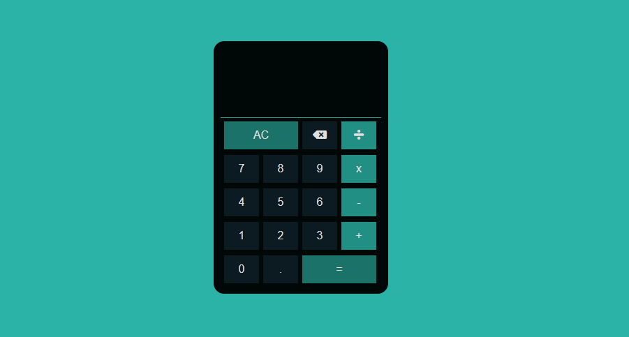

## Calculadora 
### Desenvolvido com HTML, CSS e JS.

    
    
    

### Vídeo ensinando detalhadamente como criar este projeto
https://www.youtube.com/watch?v=g3xJhlxNPbw&t=2s

### Este projeto permite a realização de operações básicas com a cálculadora.

 
    <ul>
        <li>Soma</li>
        <li>Subtração</li>
        <li>Multiplicação</li>
        <li>Divisão</li>
    </ul>

 
    

 
    

